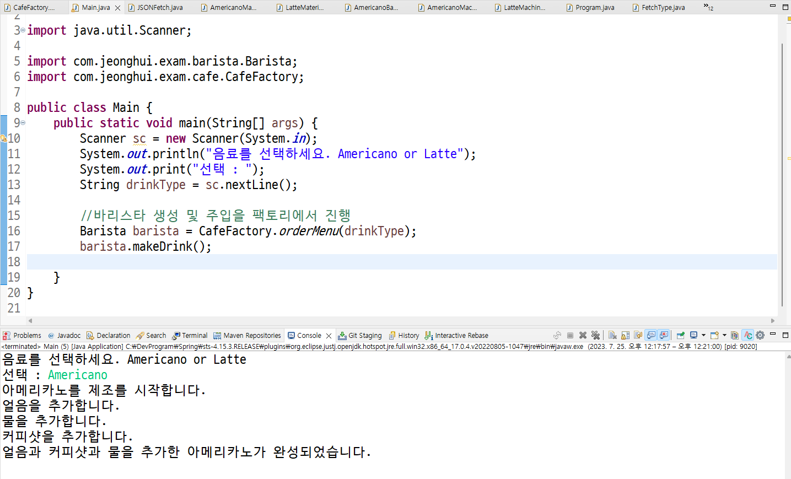
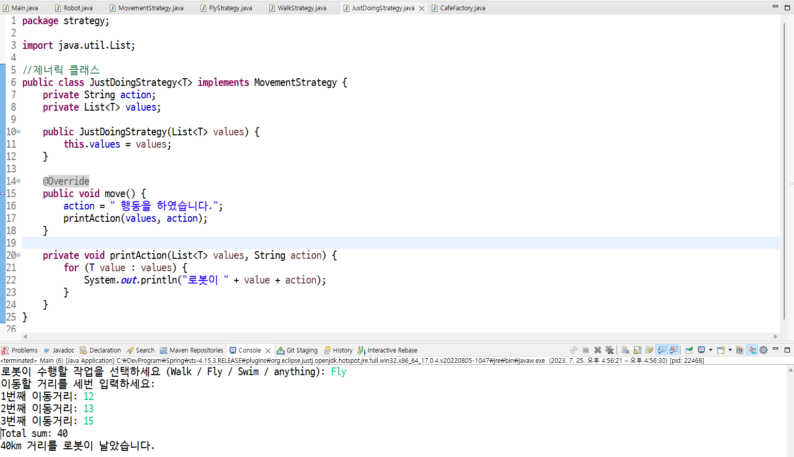

# Loose-Coupling

Java 언어를 사용해서 **Loose-Coupling**을 적용해 보았습니다. barisa(바리스타)가 machine(기계)과 material(재료)를 사용해서 product(제품)을 만드는 과정을 프로그래밍하였습니다. console에서 간단하게 동작하며 수행 결과는 아래와 같습니다.

# Data Structure Algorithm

Java 언어를 사용해서 **전략 패턴**을 적용해 보았습니다. 사용자에게 3가지 행동을 입력 받아, 숫자일 경우 그 값을 모두 더한 만큼의 행동하며, 문자일 경우 해당 행동을 그대로 수행하도록 하였습니다. console에서 동작하며 **Lamdba**, **Generic**도 적용되었습니다. 수행 결과는 아래와 같습니다.

